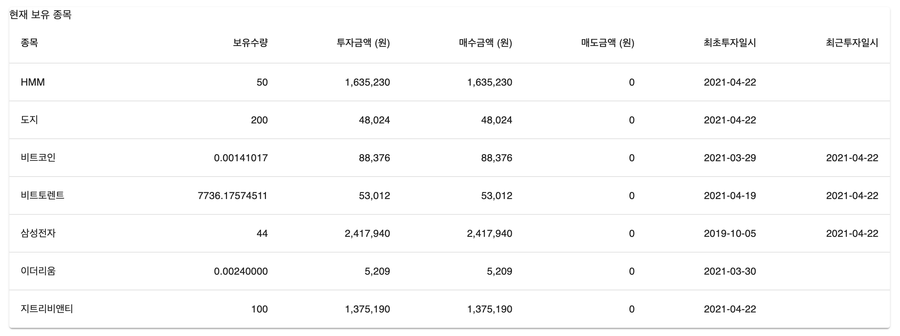
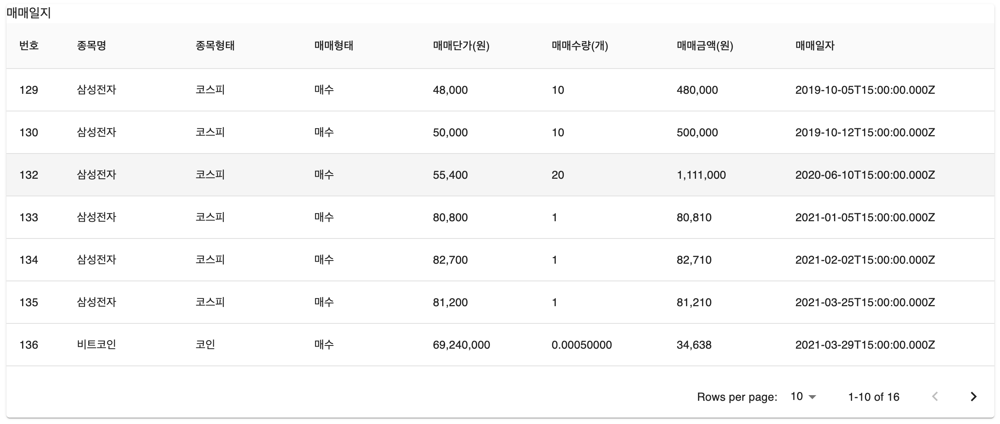
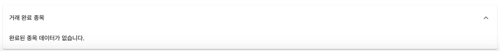

# TradingDiary

<h1>나만의 거래내역 기록장</h1>
<h3>투자 거래내용을 자신이 직접 기록해 봄으로써 자신의 매매 현황과 투자 성향을 알 수 있게하기 위해서 메모장 형식의 간단한 싱글페이지 개발 개인 프로젝트</h3>  
 
<h3>사용 스택 
</h3>
<h4>
Frontend 
<ul>
    <li>react/redux</li>
    <li>Metarial-UI</li>
    <li>axios</li>
<ul>
</h4>
<h4>
Backend 
<ul>
    <li>NodeJs</li>
    <li>Express</li>
    <li>MySQL</li>
<ul>
</h4>
 
<h3>화면 구성 (예시) </h3>
<h4> 현재 보유 종목 리스트 <h4>

 
<h4> 종목 등록 <h4>

 
<h4> 매매 일지 리스트 <h4>

 
<h4> 거래 완료 종목 리스트 <h4>

 
